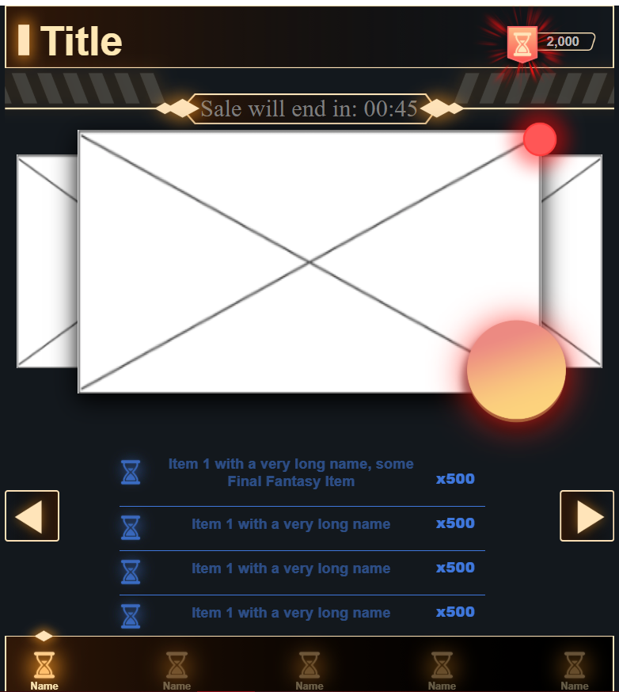
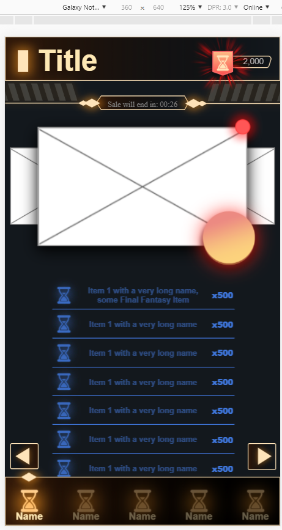
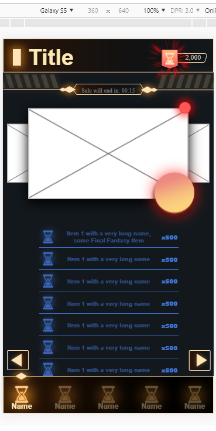
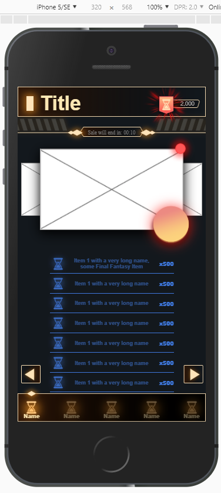
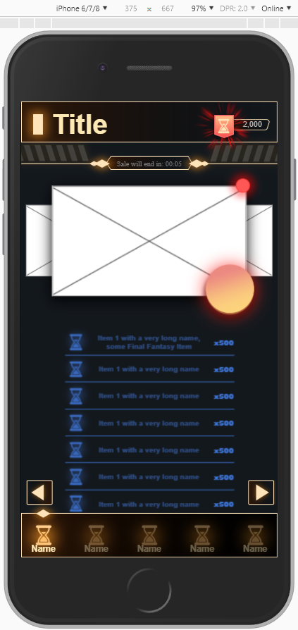
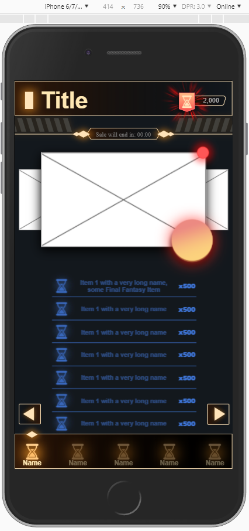
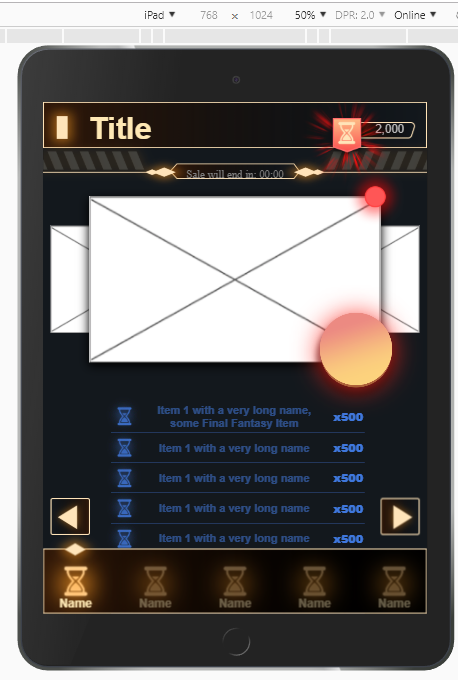
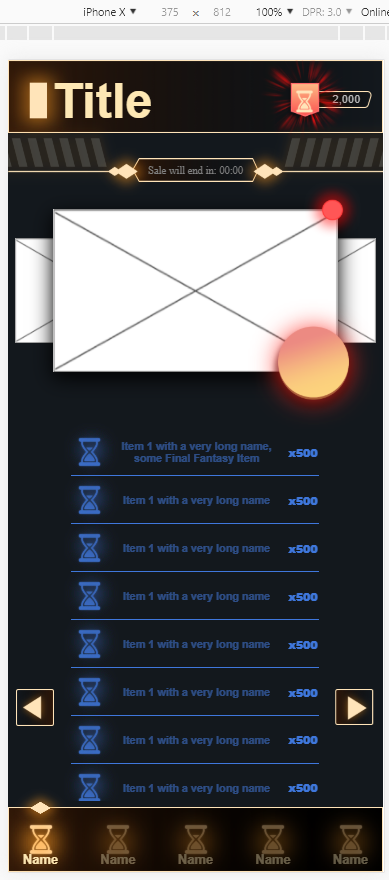
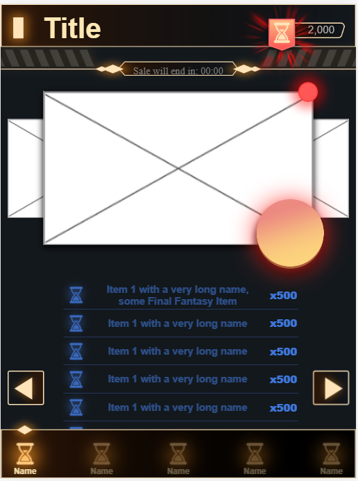

# UI-Test
This test was to create a mockup as close as possible using assets provided and have it be responsive across mobile devices.
## Desktop View

## Galaxy Note

## Galaxy S5

## Iphone 5/SE

## Iphone 6/7/8

##Iphone 6/7/8 plus

## Ipad

## Iphone x

## Ipad Pro

